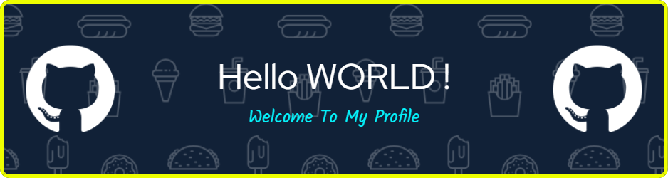

<!--Banner-->

<!--Night Owl image-->

  

<!--Header Name-->
#  ɪ'ᴍ Sandip Mali! 
*Tech Enthusiast & Aspiring Developer*
  

<!--Start Intro-->               

Passionate about building scalable web apps using Next.js, React.js, Node.js, and Python. Always learning, coding, and open to collaborating on impactful projects.

- ✨ Student of life :)
- 🌱 I’m currently learning many things, I believe that everyday is a learning opportunity.
- 👯 Open to collaboration on various web applications  
- 🤝 Looking for mentorship and partnership on Web Development projects  
- ❤ Contributing to Open Source.
- 💻 Visit my [Portfolio](https://sandipmali.com.np/) for more details about me.
<!--End Intro-->

<!--Profile Count Badge-->

  

---

<!--Languages and Tools Section-->       
<h2 align="center">Tᴇᴄʜ sᴛᴀᴄᴋ & Lᴀᴛᴇsᴛ ʙʟᴏɢs</h2> 
<picture>
  <source media="(prefers-color-scheme: dark)" srcset="./Skills_Animation_Dark.gif">
  <source media="(prefers-color-scheme: light)" srcset="./Skills_Animation_White.gif">
  
</picture>
 

<h3 align="left">Current Learning</h3>
<ul align="left">
  <li>Expanding my expertise in Next.js for full-stack development.</li>
  <li>Deepening my understanding of Python OOP concepts.</li>
  <li>Enhancing my backend skills with Express and API development.</li>
  <li>Exploring AWS services like EC2, S3, and Lambda for scalable deployment.</li>
  <li>Learning about serverless functions and microservices architecture.</li>
  <li>Working with SQL and NoSQL databases for efficient data handling.</li>
  <li>Integrating OpenAI APIs with tools like Typebot for chatbot automation.</li>
  <li>Understanding cloud deployment, domain management, and SSL setup.</li>
</ul>
  
 
 
 

 
 

<!-- GitHub Stats -->
<h2 align="center">📊 GitHub Stats 📊</h2>

<table width="100%">
  <tr>
    <td width="50%" align="center">
      <h3><strong>GitHub Stats</strong></h3>
      
    </td>
    <td width="50%" align="center">
      <h3><strong>Streak Stats</strong></h3>
      
    </td>
  </tr>
  <tr>
    <td align="center">
      <h3><strong>Latest Project</strong></h3>
      
    </td>
    <td align="center">
      <h3><strong>Top Contributions</strong></h3>
      
    </td>
  </tr>
</table>
 

<!--Contribution Graph-->
<h2 align="center">📈 Cᴏɴᴛʀɪʙᴜᴛɪᴏɴ Gʀᴀᴘʜ 📈</h2>

    

---

<!--Dynamic Quote card updates everyday at 12 PM--> 
<h2 align="center">🌟 Tʜᴏᴜɢʜᴛ ᴏғ ᴛʜᴇ Dᴀʏ 🌟</h2>

<!--STARTS_HERE_QUOTE_CARD-->

    

<!--ENDS_HERE_QUOTE_CARD-->

<!--Contact Section--> 
<h2 align="center">🤝 Cᴏɴɴᴇᴄᴛ Wɪᴛʜ Mᴇ 🤝 </h2>

  

 

<!--Buy me a coffee-->

 

<!--Footer--> 

  

